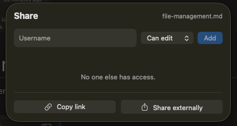
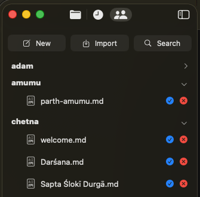
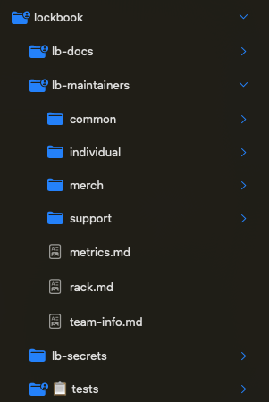

# Collaboration
You can share a file or a folder by giving someone read or write access to that file

This file or folder will then show up in *shared with me*, allowing them to preview or edit the file.

They can also *accept* the share and place it anywhere within their file tree. This provides organizational flexibility to both parties.

Collaborating in this way also allows you to manage access for various parties. For the Lockbook team, we have a single `lockbook` folder that leadership has read & write access to. Inside this folder we have an `lb-maintainers` folder which maintainers many maintainers have read & write access to. Next to the `lb-maintainers` folder there's `lb-docs` which is powering this documentation site, which many people have read-only access to. When we were designing our logo, we shared the `logo` folder with the graphic designers we were working with.

Only the owner of a shared directory will be billed for the space taken up by that directory, enabling low-cost and frictionless team usage.

You can also copy an *external* link that takes the form of `https://app.lockbook.net/uuid`. So far these links only work on Apple, but we are working towards bringing support of these links to more places. These links let you reference lockbook documents freely in chat apps like *Slack* or *Discord*.