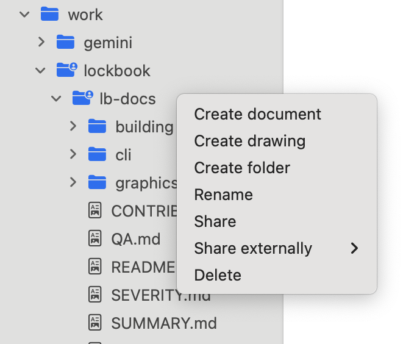

Organize your thoughts in Lockbook using **Folders** and **Documents**.

 

We draw on a computer's file systems as design inspiration for our file management as it's a familiar, portable, and scalable pattern. 

# Documents
All documents within Lockbook are compressed, encrypted, and backed up to our server. We calculate the usage of your files after compression has taken place. Compression ratios of 3-10x are not uncommon depending on your most commonly used file types.

# Uniqueness
A *File* (either a document or a folder) must have a name that's unique to it's directory. The filename is encrypted by your device and our server enforces it's unique-ness using [HMACs](https://en.wikipedia.org/wiki/HMAC). See [secret_filename.rs](https://github.com/lockbook/lockbook/blob/master/libs/lb/lb-rs/src/model/secret_filename.rs) for implementation details.

# Collaboration
You can share a document or a folder with your collaborators. Your collaborators "accept" the share by creating a link to your shared *file* and placing it anywhere. The person receiving a share can also name the link whatever they want to. This provides a significant amount of flexibility for both parties to organize their file trees however they see fit.

For instance, if Parth and Travis want to have a shared folder, Parth can call the folder *Travis*, and Travis can call the folder *Parth*. By default the original filename is preserved until either party tries to rename the shared folder. This indirection is only present for links (so only present for the actual shared folder or document), children of the shared folders have the same name for all parties.

Collaborating in this way also allows you to manage access for various parties. For the Lockbook team, we have a single `lockbook` folder that leadership has read & write access to. Inside this folder we have an `lb-maintainers` folder which maintainers many maintainers have read & write access to. Next to the `lb-maintainers` folder there's `lb-docs` which is powering this documentation site, which many people have read-only access to. When we were designing our logo, we shared the `logo` folder with the graphic designers we were working with.

Only the owner of a shared directory will be billed for the space taken up by that directory, enabling low-cost and frictionless team usage.

# Offline Access
Lockbook has made signficant investment in supporting offline access. You can access, edit, and organize your files while you're offline. Your client will store the changes you made and reconcile them with our server when you come back online. Textual and SVG content will be merged. Non-conflicting file operations will also be persisted. Some conflicting organization operations (two people renamed the same file) may be lost.

# Active areas of investment
- We'd like to make our "pending shares" screens significantly more usable, allowing you to see all the files people have shared with you without needing to create links: https://github.com/lockbook/lockbook/issues/2744
- Lockbook should be able to handle files of ~50MB without a problem. Users with powerful devices and fast network connections may be able to upload files up-to ~500MB in size. We'd like to significantly improve the experience of uploading large files and also being smart about which devices pull these files: https://github.com/lockbook/lockbook/issues/1947
- Version history is a higly requested area of ongoing investment. It involves an evolution to many of our core data structures and therefore must be done carefully. For more information see here:  https://github.com/lockbook/lockbook/issues/190