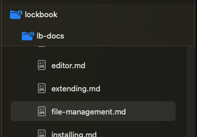
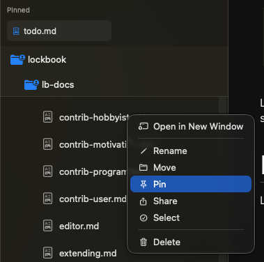
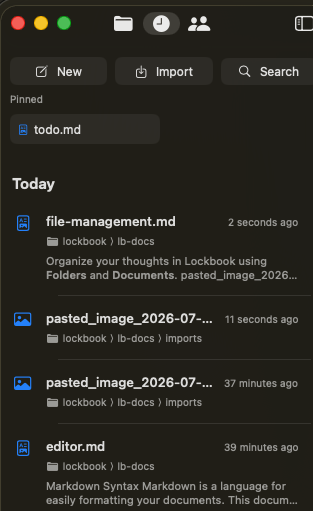

Organize your thoughts in Lockbook using **Folders** and **Documents**.

 

Lockbook doesn't impose a lockbook-specific organizational scheme onto. Your content is yours, and Lockbook helps you to structure it in a way that is universally understood.

# Documents
Lockbook supports an ever-growing list of file types.

* Tier 1 support: editable in platform
  * [Markdown](https://www.markdownguide.org/), and many other forms of plain text: See more about [our editor](editor.md)
  * [SVGs as our Drawing format](canvas.md)
* Teir 2: viewable in platform
  * many types of images
  * PDFs (these will soon be convertible to SVGs for in platform editing)
  * soon: audio then video
* Tier 3: storable
  * anything smaller than 2gb
  * soon: larger files
  * soon: automatic virtual file system implementation for seamless editing of professional document types (photoshop, docx, etc)
  * soon: automated file-system syncing strategies

All documents within Lockbook are encrypted and backed up to our server. Anything compressible is also compressed. You are charged for usage after any possible compression has been applied. Compression ratios of 3-10x are not uncommon.

In accordance with our [values (privacy)](values.md) almost everything a user inputs into our platform is encrypted and unreadable to us. This includes the names of files. See [secret_filename.rs](https://github.com/lockbook/lockbook/blob/master/libs/lb/lb-rs/src/model/secret_filename.rs) for implementation details.

On many platforms (soon: all) you can pin documents for fast navigation:

On many platforms (soon: all) you can access a "recents view" which let's you quickly reference a file that was changed recently. On Apple, these selections are sticky, so if you'd prefer an apple notes style experience where you don't really think about folders, you can do that.

# Offline Access
Lockbook has made significant investment in supporting offline access. You can access, edit, and organize your files while you're offline. Your client will store the changes you made and reconcile them with our server when you come back online. Textual and SVG content will be merged. Non-conflicting file operations will also be persisted. Some conflicting organization operations (two people renamed the same file) may be lost.

# Ingress & Egress
We strive to support a multitude of ways to get data in and out of Lockbook. Here is a rough breakdown of what's possible on each platform.

* Desktop
  * drag files in & out
  * right click import / export (or import button on macOS)
  * paste images directly into documents
  * soon: virtual file system support for seamless tier 3 files (see above)
* iOS (iPhone and iPad)
  * paste images directly into documents
  * from another app (like photos) *share* directly into Lockbook
  * take a photo directly from a document
  * soon: Files API support
* Android
  *   paste images directly into documents
  * from another app (like photos) *share* directly into Lockbook
* CLI
  * standard streams
  * invoking native text editors
  * copy from filesystem, or to filesystem
  * experimental: virtual file system

# Active areas of investment
- Version history is a highly requested area of ongoing investment. It involves an evolution to many of our core data structures and therefore must be done carefully. For more information see here:  https://github.com/lockbook/lockbook/issues/190