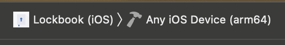
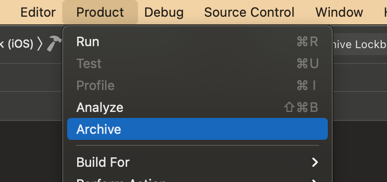
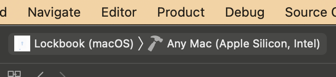
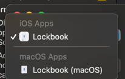

# Releasing Apple clients

## Creating Archives

1. Rebase your branch to ensure you have the most recent version of core.
2. `make swift_libs` in `core/`.
3. In xcode, select `Any iOS device` under build target: 
4. Goto `product -> archive`: 
5. Now do the same for `macOS`: 
6. Goto `product -> archive`: 

## Distributing archives (testflight)

The "Distribute archive" window pops up when a archive is built successfully. After `macOS` is built leave this window open.

1. Select iOS: 
2. Distribute App
3. App Store Connect
4. Follow Menu to the end
5. Go to test flight in your browser and complete compliance info
6. Our app uses encryption, it is not proprietary, it is not implemented by apple, and our app will not be available in france.
7. Go back to the Distribute archives view and select macOS 
8. Copy App
9. Take the resulting app and upload it to github releases.

