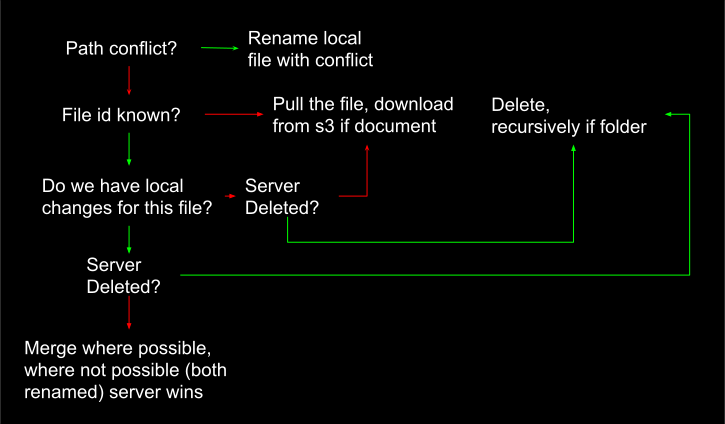

# Syncing within core

Understanding the [data model](data_model.md) is a prerequisite to understanding this document.

Sync is the means by which a client updates their local state after

Design constraints:

+ Secure / Private / Trustless -- cannot depend on server to resolve conflicts
+ Frictionless -- cannot depend on user intervention to resolve conflicts
+ Network Independent -- should allow a user to complete as many operations offline as possible

The local stores of state that are relevant to syncing are:

+ `FileMetadataRepo` -- list of all the file metadata objects known locally
+ `DocumentRepo` -- store of every document known locally
+ `LocalChangesRepo` -- a description of all the changes that have been made locally
+ `LastSyncedRepo` -- a simple `get/set` value that the sync algorithm uses to help the server filter out events that
  are already known locally

As discussed in the [data model](data_model.md), every time a file's property changes, the server increments it's
`metadata_version`. Ordering the `file_metadata` by this property is our primary means of filtering out what events a
client knows about, and what new events it has to sync.

Syncing for a new client is trivial, `/get-updates` with a value of `0` (as you have never synced before), you'll
receive a list of all the `file_metadata`s that you don't know about, save them in `FileMetadataRepo`, pull any
documents and store them in `DocumentRepo`. Set `LastSynced` to the largest `metadata_version` from your first call to
`get_updates`.

However, as lockbook is used across a handful of devices, and documents are collaborated on, the sync process becomes
more involved. This document specifies how sync behaves in various situations, and is implemented in
[sync_service.rs][sync-service].

There are 3 components to the sync algorithm:

1. `calculate_work` -- figure out what new changes are available on the server, and figure out what local work needs to
   be pushed
2. `execute_work` -- given a local or server change take the appropriate steps to add this file locally or push it up 
   to the server. This is where conflict resolution complexity lies. 
3. `sync` -- repeat this process until done, retry on retry-able errors, update `last_synced` to the appropriate value

## `calculate_work`

+ Ask the server for the latest updates since the last time we synced
    + Sort this by `metadata_version`, compare new `metadata_version` to what we know about locally. Filter out any
      matches as they will result in no-ops.
    + The `max(metadata_version)` here will be the new `last_synced` value if this sync completes without any unresolved
      errors.
+ Calculate local changes
    + Sort this by local timestamp so that if you moved a file out of a folder and deleted the folder, the ordering of 
      those events is maintained
+ Return a list of `work_units` that contain `server/local change` & `file_metadata`, server changes come first core can
    merge conflicts locally, pre-empting server rejecting our edits because they're not up to date.
      
## `sync`

1. `calculate_work`, iterate through the results and hand each `work_unit` to execute work. Many execute-work errors are
   retry-able.
   For example, if a peer edited a file during your sync, you may fail to push your changes. This is fine, however,
   because you'll pull those changes the next time this loop executes, merge, and then push your changes up (likely 
   successfully this time).
2. If there were no errors, `calculate_work` again. `execute_work` will likely cause there to be new updates. However,
   we likely know about these updates because we caused them. We `calculate_work` to prevent erroneous steps next time 
   we sync. 
3. Repeat until `calculate_work` is empty.

## `execute_work`

### `server -> core`

[src](https://docs.google.com/drawings/d/18mBM2NLZJ3Ykz64-i9BaINmnGpVfp5wXvaiwqphH7zM/edit)

### `core -> server`

Pushing local changes from core is much more trivial. Core will ask `LocalChangesRepo` what changed, and perform the
corresponding network action. If a file was renamed, for example, it will send a `/rename` request to the server.

# Future work on sync

1. Server operations like `move` currently require the metadata version. Server will make sure you have the most recent
   version before performing an action. However, this could cause a rename to fail because you don't have the most 
   recent parent version. Ideally server will simply ask for a `from` and a `to` and check that you have the right `from`.
2. Realtime sharing will likely be implemented independently of this syncing logic. This syncing logic should be regarded
   as a settlement layer of sorts, while real time collaboration will likely involve setting up an encrypted channel with
   peers.

[sync-service]: https://github.com/lockbook/lockbook/blob/master/core/src/service/sync_service.rs